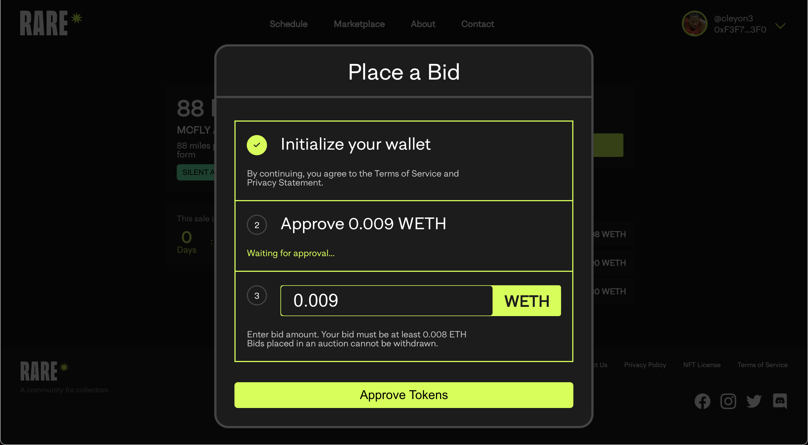
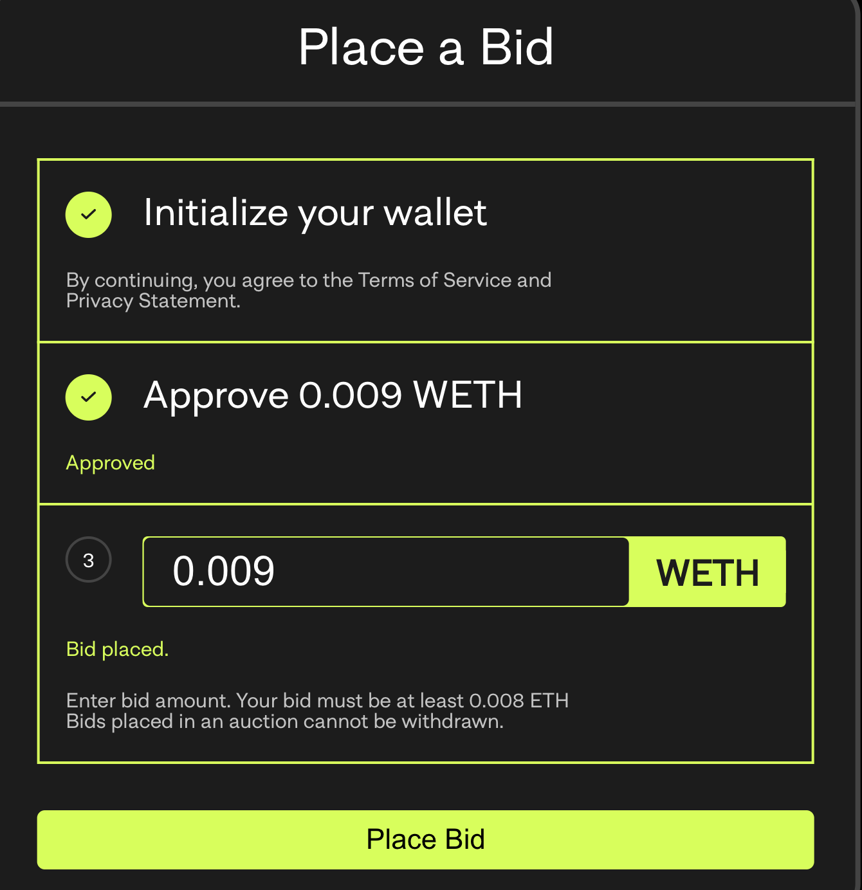

# Making a Bid

Once you know if you will be using crypto or credit, you are ready to bid. It’s important to note that when you place a bid, it happens in a centralized manner until the auction is over. At that time, the top bid will effectively win the auction, and the NFT will be transferred. 

###How do I make a bid? 

Under a drop you will see a place bid button. 

Go through the steps:
1. Initialize Wallet
2. Approve amount
3. Enter Bid amount 

If you seen “Bid placed”, you have made a bid successfully. 

Additionally:
1. Keep track of your WETH balance. 
2. Open MetaMask and check your WETH balance after making Purchases. 
a. Bear in mind that it may take time before a Purchase transaction completes, in order for your WETH balance to be affected. 
3. For Bids and Auctioned NFTs, check your WETH balance after the Drop with the auction items ends. a. Your WETH balance should reflect the debit of your winning Bid amount right after you receive an email notifying you of winning the Bids on an Auctioned NFT. 

###How do I cancel a bid? 
All bids are final, and cannot be cancelled. Please ensure that you want to place a bid before doing so. 
###How do I know if I win a bid?
You will see an email notifying if you won a bid or not, the NFT can be viewed in your NFT Gallery in your profile. 

###Buying a NFT
1. Find an NFT that is available for Purchase, and click on the Purchase button. 
2. MetaMask should pop-up displaying Connect With MetaMask. 
Ensure your account/wallet is selected, then click Next. 
3. MetaMask will then display Connect to Buyer (...50dd), below which is a Connect button for you to click. 4. On the RARE.Store page, there should be a “Complete Your Purchase” dialog displayed. 
Click on the Approve Tokens button to proceed. 
5. MetaMask pops up again. Click the Confirm button to Allow the RARE.Store to spend your WETH. 6. The RARE.Store may state “Waiting for approval”. Please wait until you see Approved under Approve Tokens. 7. Click the checkbox to the left of Confirm 0.011 WETH Purchase. 
8. At last, click the Purchase NFT button. 
9. The page should display a Purchase Complete dialog.
